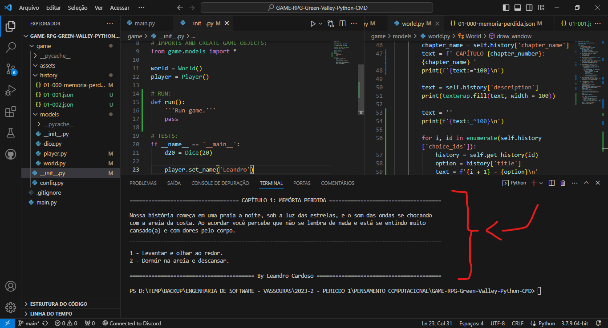

# RPG Green Valley

**<a href="https://github.com/Leandro-Cardoso/STUDY-HTML-CSS-JavaScript-Git-GitHub/blob/master/LICENSE" target="_blank">
    🔑 MIT License
</a> 
<a href="" target="_blank">
    🌎 EXECUTÁVEL DO PROJETO
</a>** - Download indisponível

    <h2>Sobre</h2>

⚙️🔨 **Em desenvolvimento** (alpha) 
Um RPG de texto para rodar no terminal, com uma prévia de minha história original, que se passa na pequena região de Green Valley..  
Esse projeto foi desenvolvido como trabalho da Universidade de Vassouras, curso de Engenharia de Software, disciplina de Pensamento Computacional, ministrada pelo professor João Coelho. 

    

### ⚙️ Tecnologias:
* Python
* Json
* Git e GitHub

### ⚙️ Development:
1. Classe Dice ⚙️✔️
2. Classe Player ⚙️✔️
3. Classe World ⚙️✔️
4. História separada usando Json ⚙️✔️
5. Função para buscar história ⚙️✔️
6. Função para imprimir tela ⚙️✔️
7. Sistema de batalha ⚙️🔨 Em desenvolvimento
8. História completada ⚙️🔨 Em desenvolvimento
9. Menu ⚙️🔨 Em desenvolvimento
10. Créditos ⚙️🔨 Em desenvolvimento
11. Executável funcional ⚙️🔨 Em desenvolvimento

    <h2>Autor</h2>
    <a href="https://github.com/Leandro-Cardoso" target="_blank">
        
        <h3>Leandro Cardoso</h3>
    </a>

